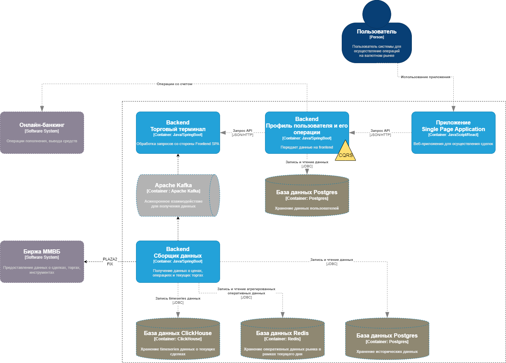

# Совкомбанк Хакатон 2022

Сервис развернут по адресу - http://bigint.ru

## Задача
Разработка приложения для проведения операций на финансовом рынке

##Решение
Приложение представляет веб-сервис, главной функцией которого является терминал для осуществления сделок.

Структура проекта:
- [./data](./data) - презентация, сопроводительная документация
- [./web-app](./web-app) - веб-сервис (стек Java, Spring Boot, Postgres, JS)

## Целевая архитектура

##Реализованные фичи

- (+) Ролевая модель (пользователь и администратор приложения, необходимы интерфейсы для каждой роли)
- (+) Функционал регистрации новых пользователей (в рамках процесса регистрации создается первый рублевый счет для торговли)
- (-) Функционал подтверждения регистрации для администратора приложения
- (-) Функционал для блокировки/разблокировки пользователей
- (???) Функционал для пополнения и выведения средств с рублевого счета
- (-) Функционал открытия нового счета для проведения операций над выбранной пользователем валютой
- (???) Отображение сводной информации по имеющимся в портфеле пользователя активам. Состав представленной информации должен быть обоснован
- (???) Отображение исторической информации о движении валюты (отчет по сделанным операциям)
- (+) Отображение общей информации о пользователе приложения в удобном и понятном для пользователя виде (профиль текущего пользователя), в т.ч., и информация о реквизитах счетов, с которых совершаются операции над валютами
- (+) Функционал торговли, возможность покупать и продавать валюту по рыночному курсу (курс из внешнего источника)
- (+) Визуализация графика стоимости валюты/валют за период (график изменения стоимости)
- Расчет и визуализация прогнозной стоимости валют(технический анализ, регрессионные модели, ML и т.д.)

